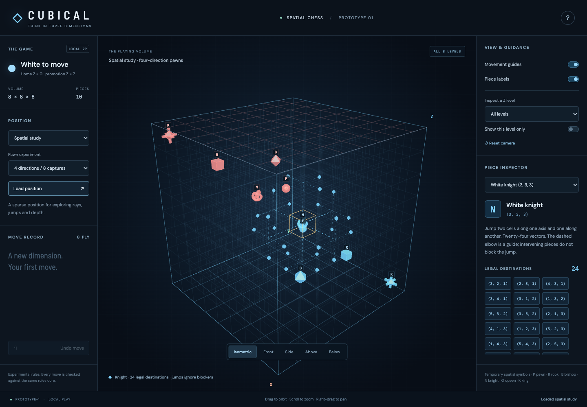

# Prototype-1 vertical-slice results

18 September 2026. The functional slice is implemented and available through `npm run dev`. Automated verification passed. This is the implementation checkpoint before final piece design, saved-game archives, AI, and optical polish.

Subsequent movement-field and hover/focus changes are documented in the [Stage 3 spatial UI refinement report](SPATIAL_UI_REFINEMENTS.md); the measurements and screenshots below describe the original slice.

## What is playable

The browser presents one 8 × 8 × 8 cube with the approved 16-piece White army on Z = 0 and Black army on Z = 7. Players can select pieces, inspect legal destinations, move and capture, choose promotions, alternate turns, and undo. The rules core handles check, checkmate, stalemate, repetition, kings-only draws, and the experimental 100-ply no-progress rule.

The default pawn profile has four quiet vectors and eight capture vectors exactly as discussed. A three-direction/six-capture comparison can be loaded from the position panel. Selecting a profile does not change an existing game; **Load position** starts a new game with that profile.

Four starting positions are available:

| Position | Purpose |
| --- | --- |
| Opposing planes | The full approved setup; neither king is checked and neither army initially attacks the other. |
| Spatial study | A sparse 10-piece position with a central knight and 24 legal destinations, including a capture. |
| King safety | A rook shields its king from a bishop on a body diagonal. Its geometric moves exist, but none are legal. |
| Promotion study | A pawn can reach the opposing home plane either quietly or by capture and choose any of four promotions. |

The Three.js view supports orbit/pan/zoom, five camera presets including a view from below, layer emphasis/isolation, legal markers, slider paths, and dashed knight jump guides. An explicit depth chooser handles overlapping pick targets. A piece navigator and destination buttons provide an alternative to canvas picking. Tablet controls use tap selection, one-finger orbit, and two-finger pan/zoom.

## Verification

- `npm test -- --reporter=verbose`: **28 passing tests**. Coverage includes independent endpoint checks for slider geometry, all 512 coordinate round trips, blockers, knight vectors/jumps, both pawn profiles, backward captures, pins, king safety, promotions, terminal states, repetition, and make/unmake restoration through a 40-ply sequence.
- `npm run test:browser`: **10 passing Chromium scenarios**. Actual canvas pointer selection and capture, complete undo, camera gestures without moves, promotion/cancel, profile comparison, layer filtering, a depth chooser, and touch input all passed. The tested layouts are 1440 × 1000, 834 × 1194 and 1194 × 834. No uncaught browser exceptions were recorded.
- `npm run build`: TypeScript checking and production bundling passed. Vite reports the single JavaScript chunk above its 500 kB advisory threshold: approximately **602 kB minified / 153 kB gzip**, including Three.js. This is a loading/caching consideration for later work, not a failed build.

Tests ran on this development machine with Node.js 22.12 and Playwright Chromium using software WebGL. Tablet tests emulate viewport and touch input; they do not establish physical iPad/Android performance or Safari compatibility. Observed human play sessions and recognition tests remain necessary before declaring the spatial interface successful for new players.

## Rule findings

The full opening produces **143 legal moves for White**, substantially more than a conventional chess opening. The broad slider geometry makes the empty middle immediately available. King mobility and the eventual pace of pawn contact still need real games to assess; a constructed 3D checkmate works, but that does not establish practical mating difficulty or balance.

The two pawn profiles each start with two quiet moves per pawn: the board boundary blocks outward Z movement and the back rank occupies the backward Y cell. Once those restrictions disappear, the four-direction profile has its extra backward planar move. The sparse study verifies the expected four-versus-three quiet destinations. Pawn attacks change X by one and change exactly one of Y/Z by one; pure Y–Z captures and straight captures are excluded.

Quiet pawn moves remain reversible and increment the no-progress counter. Captures and promotions reset it. The tests demonstrate an actual repeated pawn shuffle reaching a repetition draw. No further movement-rule changes were needed to make the slice functional.

## Interaction findings and fixes

Nearest-hit picking alone was insufficient when viewing aligned pieces through a face. The implemented chooser lists the actual intersected coordinates and occupants before committing selection. The whole cube remains selectable with movement guides disabled; isolation is optional.

Camera presets needed to clear accumulated orbit damping before setting the requested view. Resizing now preserves the camera direction while adjusting its distance to the new aspect ratio. Pointer movement beyond the click threshold, secondary-button pan, and multi-touch gestures suppress move commits. When a selected or moved piece is on a different isolated level, the level follows it rather than leaving the action invisible.

Temporary pieces use spheres/polyhedra, a knot for the knight, a three-axis cross for the king, and an orbit-ring core for the queen, with letter labels as a reliable fallback. These are functional placeholders. Stage 3 explicitly requires intrinsically three-dimensional symbols that can be identified from front, rear, sides, above, below and oblique views; the Queen's distributed core/surface concept is recorded there. This recognition requirement has not been validated by the current placeholders.

## Performance and architecture

A sample of 25 complete legal-move generations per fixture in Node.js produced:

| Position | Legal moves | Mean generation time |
| --- | ---: | ---: |
| Opposing planes | 143 | 3.31 ms |
| Spatial study | 97 | 0.88 ms |
| King safety | 23 | 0.19 ms |
| Promotion study | 18 | 0.07 ms |

These are development measurements from one run, not device guarantees. They are adequate for interactive selection. The 143-move opening confirms that AI must use its planned worker, pruning, and time budget; assuming a fixed three-ply completion time would be premature.

The opening view reports 80 draw calls and 4,560 triangles; the selected-knight study reports 33 draw calls and 1,440 triangles. The lattice uses batched lines, destination markers are instanced, and piece geometry is shared. Rendering occurs after state/camera changes and during animation, avoiding continuous scene redraws when idle. Software-browser startup render timings varied, so this report makes no steady 60 FPS claim. Physical desktop and tablet profiling remains a Stage 3 gate.

The rules modules run without DOM or Three.js imports. They own occupancy, piece identity, turns and histories. The view consumes engine-provided legal moves and paths. A user command regenerates legality before commit, so stale or misleading visual state cannot authorize an illegal move. Explicit player ownership, rule-profile IDs, and make/unmake records provide the intended foundations for save formats and later search; the actual game rules and AI scope remain two-player.

## Next stages

The current move log is in memory and a reload resets the game. Stage 3 still needs localStorage save/resume and archives with versioned rule profiles, final piece recognition work, and broader tablet/browser validation. Stage 4 adds the modest worker-based opponent. Threat fields, ghost previews, optical effects, and online/multi-player variants retain their later places in the plan. No neural engine, final art pipeline, or multiplayer server was introduced for this slice.

[Tablet portrait](prototype-1-tablet.png) · [Tablet landscape](prototype-1-tablet-landscape.png) · [Approved plan](../THREE_DIMENSIONAL_CHESS_PLAN.md)
