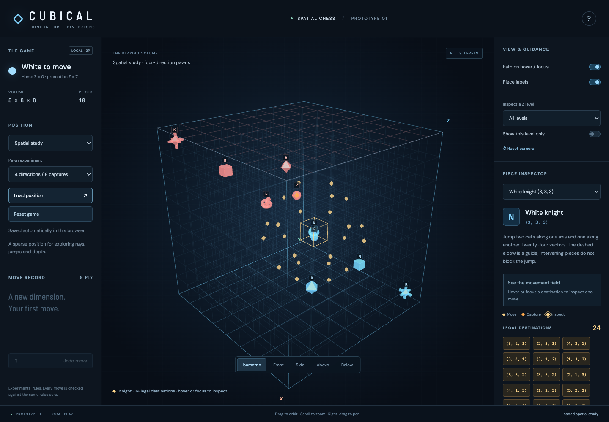
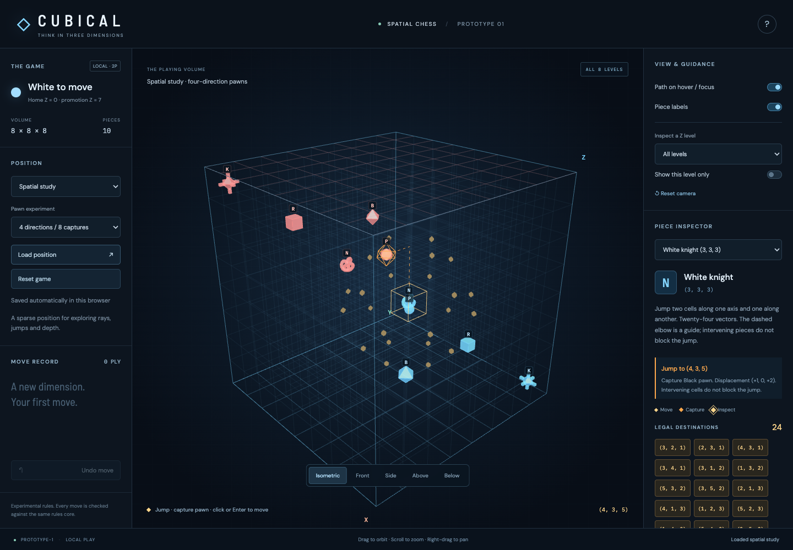

# Spatial movement fields — Stage 3 refinement

18 September 2026. This extends the verified prototype's view and interaction layer. The rules modules and experimental movement profiles are unchanged.

## Implemented

- Selecting a piece reveals its complete legal-destination constellation. No paths appear until inspection. All 24 Knight destinations remain present while one is inspected, with unrelated markers dimmed moderately.
- Canvas hover and destination-button focus emphasize one marker and reveal one guide. Slider guides follow the engine-provided path exactly. Knights have a dashed elbow representing their jump; the elbow does not impose intermediate occupancy requirements.
- Ordinary, capture and inspected destinations share an octahedral marker family. Ordinary destinations use gold, distinct from the blue army. Captures use warmer amber and slightly greater size; inspection adds brightness, scale and an outline. The fine lattice retains its existing weight.
- The inspector describes displacement and capture, and reports prospective check through a read-only query using the existing rules engine on a cloned position. Promotion-dependent checks are identified explicitly. No live piece, turn, draw counter or history changes during inspection.
- Mouse click and keyboard Enter commit. Touch uses a first tap to inspect and a second tap on the same destination to commit. Navigation clears the preview. The depth chooser remains available for overlapping cells.
- The complete volume remains the default. Level isolation is an inspection aid. The expanded inspector scrolls on smaller screens without overlapping its footer.

## Verification

- **31 unit tests passed**, including the original 28 rules tests and three preview tests covering check, promotion-dependent check, capture, and preservation of the complete live state.
- **14 Chromium browser scenarios passed**: canvas hover, 24 retained destinations, a single dashed Knight elbow, keyboard inspection/commit, exact slider and step paths, preview clearing, check explanations, two-tap touch capture, camera gestures, promotion, undo, isolation and depth selection.
- TypeScript checking and production build passed. The JavaScript bundle is approximately **606 kB / 155 kB gzip**, with the existing Vite advisory above 500 kB.
- The uninspected Knight field recorded **32 draw calls and 1,440 triangles** in software WebGL. One inspected guide and outline add two draw calls. Check inspection is cached per destination until selection or game state changes; rendering remains event-driven.
- Screenshots were reviewed at desktop 1440 × 1000 and emulated tablet landscape 1194 × 834; portrait 834 × 1194 is also covered by the browser suite. A targeted layout assertion checks that the inspector footer does not overlap the selected-piece section.

These automated touch checks use Chromium emulation. Physical tablet performance, Safari behaviour and human comprehension still need playtesting. No new frame-rate claim is made from software rendering.

## Recorded design direction and remaining scope

The plan now explicitly preserves the sequence **selection → constellation → destination inspection → individual trajectory → consequences → commitment**. The Knight's knot-like placeholder is a reference for recognising spatial forms without a privileged upright view. Final pieces retain the intrinsic three-dimensional symbol requirement, including the Queen's distributed identifying geometry.

Future threats should begin with an engine-derived danger-zone field. Inspection of a threatened cell or enemy piece can reveal the particular attackers and trajectories; permanent fans of attack rays are excluded from the default design. Check-giving destinations currently receive a text explanation on inspection. A subtle marker-rim variation can be explored later if needed.

Threat fields, ghost models, final piece designs, browser save archives and the worker opponent are not implemented by this interaction refinement. Their existing places in the staged plan remain. No rule changes were needed.

[Approved plan](../THREE_DIMENSIONAL_CHESS_PLAN.md) · [Original slice report](PROTOTYPE_1_RESULTS.md) · [Tablet portrait](spatial-field-tablet.png) · [Tablet landscape](spatial-field-tablet-landscape.png)
