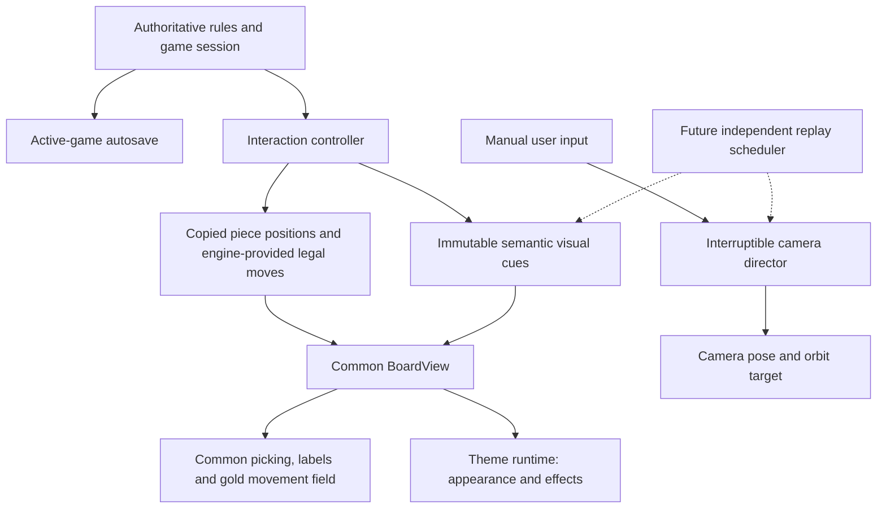
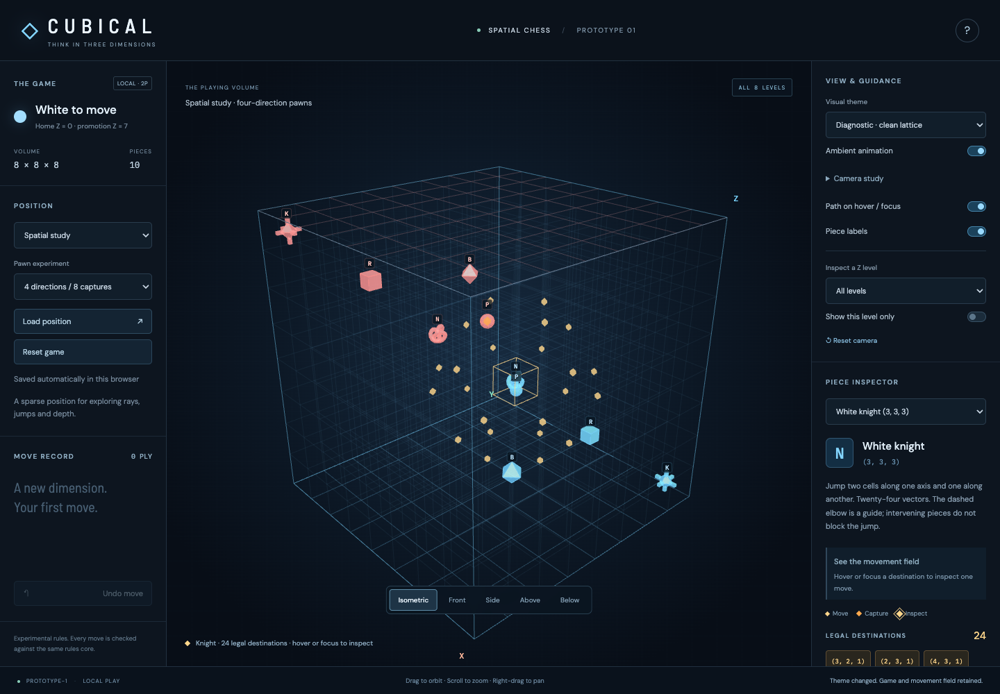
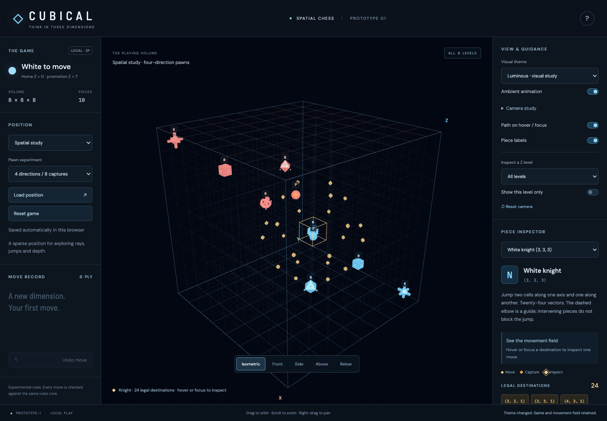

# Theme and camera architecture spike

18 September 2026. A limited architecture experiment, with **Diagnostic** as the startup/default theme and **Luminous** as the single visual study. No movement rules or save semantics change.

Follow-up: the approved spike is preserved. A separate [bounded Crystal experiment](CRYSTAL_OPTICAL_EXPERIMENT.md) now uses the theme contract; the findings below describe the original Diagnostic/Luminous spike.

## Try it

Run `npm run dev`. In **View & guidance**, select **Luminous · visual study**. The **Spatial study** position is useful for comparing the 24 Knight destinations with the diagnostic view. Gold remains reserved for legal destinations and amber for captures across both themes.

Open **Camera study**, select a piece, then use **Focus selected** or **Inspect orbit**. Focus eases over 650 ms; inspection then performs one 12-second orbit. Pointer down, wheel or keyboard input cancels the shot immediately, retaining its current pose for manual navigation. Camera presets still return to full-cube views. **Ambient animation** disables background scintillation and transient capture effects. Reduced-motion preference disables those effects, makes focus immediate and prevents automatic orbit.

Theme choice and camera pose are deliberately session-local in this spike. Reload resumes the authoritative saved game using Diagnostic. Loading/resetting a game and undo remain independent of presentation.

## One semantic scene

The view stores frozen copies of piece descriptors and copies of legal moves. A theme receives only `{type, owner}` appearance descriptors and frozen visual cues with coordinates. Neither themes nor the director receive a game session, move validator, save writer or command callback. The rules engine remains the authority for occupancy, legality, captures, check and promotion. Themes never calculate moves.

### Theme contract

`src/view/themes/types.ts` defines the small extension boundary. `src/view/themes/index.ts` supplies the two runtimes; registration is through `THEMES` and `createTheme`.

| Concern | Theme responsibility | Common view responsibility |
| --- | --- | --- |
| Environment and lighting | Own a decoration/light root, background and optional environment texture | Attach/remove it; suspend animation in hidden tabs |
| Playing volume | Supply lattice colour/opacity and boundary/home emphasis; add decorative shell geometry to the theme root if needed | Keep the same 512-cell coordinate frame and inspection planes |
| Pieces and materials | Create a spatial symbol for a type/owner; release its resources | Place it at the authoritative cell, attach labels and fixed pick proxies |
| Movement/capture | Supply movement timing/easing; consume visual cues for transient effects | Commit rules immediately, animate only the displayed transform; clear transients on undo/reset/switch |
| Particles | Own bounded decorative geometry and update it at an explicit cadence | Never include decoration in picking or legal-destination generation |
| Post-processing | Optional render/resize/dispose adapter, with owned targets and passes | Separate world layer from crisp legal markers/guides, then render DOM labels |
| Selection and threats | React visually to supplied cues, if enabled | Retain canonical legal/attack data, stable marker vocabulary and interaction hierarchy |

Gold destinations, amber captures, jump/ray guides and selection remain on a common interaction layer. An optional postprocessor renders the world first; the renderer then composites this interaction layer without post-processing. Neither shipped theme activates a postprocessor: its integration and lifecycle are prepared, but effect quality and performance are not yet validated. Three.js provides camera/object [layers](https://threejs.org/docs/pages/Layers.html) and a separate [EffectComposer](https://threejs.org/docs/pages/EffectComposer.html) for that later work.

Themes currently allocate small per-piece visuals with explicit disposal. This is simple for 32 pieces. Repeated switches are checked for stable renderer geometry/texture counts on returning to Diagnostic. Shared geometry/material caches or instancing within a theme remain an optimisation if measured resource costs justify it. Theme geometry is not the pick target: changing a silhouette cannot change the cell selected by a raycast. Symbols should stay within their cell, with the central portion close to the existing pick proxy.

## Implemented experiment: Abstract / Luminous

The experiment uses darkness, an electric-blue rim light, brighter material emission, tiny surface glints, sparse blue background scintillation, and a brief amber capture pulse. The lattice is slightly quieter than Diagnostic, rather than thicker. No copied title-sequence objects or external art assets are used.

The topology hints are deliberately small:

| Piece | Study treatment | Recognition question |
| --- | --- | --- |
| Pawn | Compact faceted seed | Does it remain clearly subordinate to larger forms? |
| Rook | Cube with short extensions on all three axes | Does its cubic core distinguish it from the King's longer cross? |
| Bishop | Octahedral core with tetrahedrally distributed diagonal nodes | Does the diagonal character read from oblique views? |
| Knight | Existing knot with a sparse surrounding node motif | Does the knot remain the main identifying feature? |
| Queen | Faceted core and three surrounding rings | Can the distributed silhouette remain distinct at board scale? |
| King | Central core and three longer crossing bars | Is it recognisable below and from a face without relying on its label? |

These remain temporary symbols. They are not diagrams of all legal moves. The complete movement constellation is still revealed by selection, and only the inspected destination gets a path. Player colours and letter labels remain available in both themes.

The ambient environment uses 96 faint points outside the volume, submitted as one point-cloud draw. Their brightness changes at most 30 times per second while effects are enabled. Surface glints are static geometry whose appearance changes with viewpoint. This spike does not yet implement internally flowing piece textures or bloom. The capture pulse lasts 350 ms; theme-specific movement interpolation lasts 260 ms versus Diagnostic's 190 ms. No effect duration delays the authoritative game transition or save.

## Other directions accommodated, not implemented

| Direction | First bounded experiment using the same contract | Legibility and cost checks |
| --- | --- | --- |
| Crystal / Optical | An edge-biased shell in the theme root; very restrained transmission and spectral accents; faint projected illumination outside important silhouettes | Compare picking alignment and piece separation through front/back shell faces; reject duplicate-looking pieces and displaced silhouettes. Keep dispersion off labels and legal markers. |
| Deep Space | A sparse star environment with an almost invisible boundary; spacecraft/probe-like variations of the same type silhouettes | Ensure stars cannot resemble gold destinations; keep army colour, relative piece scale and type labels consistent. Test full armies, not only sparse studies. |
| Aquarium / Water Volume | Low-density particles, gentle procedural shafts/caustic-like patterns and a short local movement disturbance | Begin without refracting pieces. Check that far pieces and captures retain contrast through haze; fade or remove haze during isolation if it competes with cell reading. |

For Crystal, Three.js `MeshPhysicalMaterial` supplies transmission, thickness, index of refraction, iridescence and dispersion, with extra per-pixel cost as features are enabled. Those controls offer a starting point, not evidence that a whole refractive cube will remain readable. [Material reference](https://threejs.org/docs/pages/MeshPhysicalMaterial.html).

Caustic-like illumination, internal-reflection accents and diffraction/scintillation can initially be art-directed shader effects. Physically accurate multi-bounce optics is outside this spike. Keep those experiments individually switchable and compare against Diagnostic before combining them. The post-processing adapter can later host restrained bloom or spectral treatment, with explicit resize/disposal and quality controls. No additional themes require their own game renderer or rule implementation.

## Camera director and future replay

`CameraDirector` has only the perspective camera and manual-control target. It interpolates a pose, frames a point/region based on aspect ratio and field of view, or executes a short orbit. It does not subscribe to game commands or automatically seize the camera on ordinary selection.

`SceneCue` includes selection, trajectory, move, capture, check and resulting-position beats. The live controller supplies actual move/capture/check cues after rules validation; the common view supplies selection/trajectory cues. The director's `focusCue` adapter can frame those immutable cues, including both ends of a move. Unit tests exercise every cue kind. Live play uses explicit focus/orbit controls; scripted replay timing is future work.

| Mode | Status and intended ownership |
| --- | --- |
| Manual play | Implemented; normal OrbitControls remains active and receives the very input that interrupts a shot. |
| Focus piece/region | Implemented director API; selected-piece focus is exposed in the UI. Region framing is used by the move-cue adapter. |
| Piece inspection | Implemented one-turn orbit after focus; input cancels without snapping back. |
| Saved-game replay | Designed, not implemented. A separate replay session legally reconstructs saved commands into its own state, publishing scene snapshots/cues. It never replaces or autosaves the active game. |
| Cinematic replay | Future scheduler optionally adds camera shots to the replay timeline; replay can also keep a manual camera. |
| Demo/attract | Future scheduler uses a fixture or recorded game in an isolated replay session. Input cancels camera and demo scheduling and returns to the active game. Never enabled implicitly during play. |

A future replay timeline should order **position → selection → trajectory reveal → movement → capture/arrival → check → resulting-position hold**. The replay controller advances its own state, derives moves/check from the rules engine and emits visual snapshots. A scheduler coordinates display time and director cues, including pause, seek and speed changes. Seeking rebuilds a replay snapshot and clears transient effects before resuming; the director receives a new pose target, not a saved game object. A generation/cancellation token must discard queued camera cues after interruption. Manual camera takeover may allow ordinary replay to continue, while attract-mode takeover should stop the demo entirely.

The current capture pulse starts when the move commits. There is no timeline synchronising capture arrival, check reveal and camera hold yet. That is an explicit limitation of this spike, not a finished cinematic replay implementation.

## Findings and verification

Measurements and screenshots below document this development machine's Chromium software WebGL run. They are not physical tablet/GPU measurements.

| Same isometric Knight study, 10 pieces / 24 legal destinations | Diagnostic | Luminous |
| --- | ---: | ---: |
| Draw calls | 32 | 53 |
| Triangles | 1,440 | 1,912 |
| Renderer-resident geometries | 34 | 55 |
| Renderer-resident textures | 1 | 1 |

Luminous adds about **66% more draw calls** and **33% more triangles** in this sparse scene, mostly from the per-piece glints and topology details. This is acceptable for an experiment, but it is measurable overhead even without bloom or transmission. Returning to Diagnostic after three switch cycles recovered the baseline geometry/texture counts; this checks renderer resource counts, not total driver/heap memory.

During short camera runs, median CPU render-submission times were approximately **1.1 ms for each theme**; the sample was small and camera frustum culling changed draw counts during orbit. The full 32-piece opening with the Queen selected recorded **135 draw calls and 5,768 triangles** in Luminous; its 33 legal destinations matched Diagnostic exactly. First-use costs were much larger: a Luminous sample reached **304 ms** during initial shader/material setup. These numbers include the renderer call and CSS labels, not completed GPU frame times. They cannot establish frame rate or imply equal GPU cost. Shader warm-up and physical-device profiling are prerequisites before expanding the material/effect set.

- `npm test`: **54 passing unit tests**, including the original rules/save/preview tests and nine director tests for interpolation, interruption, reduced motion and all six semantic cue kinds.
- **25 browser scenarios verified** (23 in the full regression run, followed by two additional dense-position/tablet scenarios and a rerun of camera interruption). Browser coverage includes preserved board/history/save/selection across theme changes, repeated-switch resource recovery, exact legal-field retention, capture/undo, keyboard/pointer/wheel interruption, reduced-motion idle rendering, and the existing autosave/reset and desktop/tablet interaction scenarios. Additional dense-position and themed touch checks accompany the screenshots.
- Production build and TypeScript checking pass. Bundle size is approximately **622 kB / 159 kB gzip**; Vite's existing 500 kB chunk advisory remains.
- No rules or saved-game format modules were changed. No shader errors were observed in the checked renders.

[View from below](theme-luminous-below.png) · [Dense opening](theme-luminous-opening.png) · [Tablet](theme-luminous-tablet.png)

Visual review findings:

- The gold Knight constellation stays distinct from both armies and the blue decorative environment. The reduced lattice weight still leaves depth cues visible in the sparse study.
- In the dense opening, both army colours and the Queen’s movement constellation remain visually separate, but back-rank pieces and labels crowd each other in projection. No stronger glow or volume distortion should be added before that recognition problem is tested with users.
- From directly below, destinations and pieces overlap in projection. This remains a geometric ambiguity: orbiting, the existing depth chooser and optional slice inspection are still necessary aids. Extra optical effects would not resolve it.
- Rook/King axial motifs could converge at small sizes. The cubic Rook core and longer King bars offer a distinction, but labels remain important pending human recognition tests. Current screenshots do not establish label-free recognition.
- Sparse glints and a faint environment are a conservative proof of the architecture. Stronger glow, transmission and haze have not been validated. A whole-volume glass shell was deliberately left for a separate experiment with explicit silhouette and picking tests.
- Continuous scintillation costs idle redraws; turning ambient animation off restores event-driven rendering. Reduced-motion mode also remains static. Camera movement still requires continuous frames in either theme.

### Gate before deeper polish

Observe real users selecting quiet moves/captures with labels on and off, recognising all six types from multiple faces and below, and recovering from overlapping projections. Compare dense opening positions and midgames in both themes, on physical desktop and tablet hardware. Record frame intervals, GPU cost and energy/idle behaviour separately from CPU submission time. Add one optical/water effect at a time only if recognition, destination accuracy and responsiveness remain at least as good as Diagnostic.
